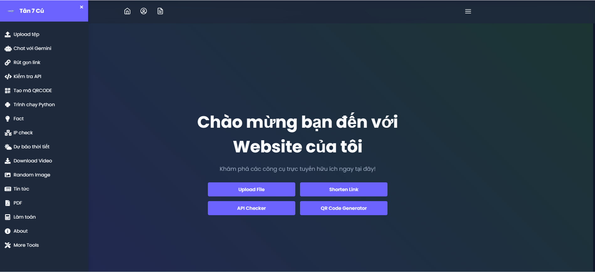

# Tanbaycu - First Web Project 🌐

  

---

  
  
  

---
- **Project Type**: Multi-tasking Website  
- **Status**: 🟢 Ongoing (Started on: 12/10/2024)  
- **Author**: Me & Flask
- **Support**: `Github` `VSCode` `Github Copilot` `ChatGPT` `Gemini` `Thonny`

--- 
## 🛠️ Tech Stack

- **Frontend**: `HTML`, `CSS (Bootstrap)`, `Tailwind CSS`, `Javascript`
- **Backend**: `Python (Flask)`
- **APIs**: `OpenWeatherMap`, `TinyURL`, `GoFile`, etc.
- **Database**: `Flask-SQLAlchemy`, `Vercel-KV`
- **Hosting**: `Vercel`
---

---

## ℹ️ Important Notes

- Để xem các bản cập nhật giao diện mới nhất, vui lòng truy cập [Trang chủ](https://tanbaycu.vercel.app) và **xóa bộ nhớ cache của trình duyệt**. Do ứng dụng sử dụng các route, trình duyệt của bạn có thể tải một phiên bản cũ của trang web từ bộ nhớ cache thay vì phiên bản mới nhất. Việc xóa cache sẽ đảm bảo rằng bạn thấy giao diện và tính năng mới nhất.
- Tất cả các chức năng của trang web đều được hỗ trợ bởi các API để đảm bảo tích hợp và hiệu suất liền mạch.

## 🎥 Demo Video

Xem video giới thiệu dự án tại [đây]

## 🎉 Live Demo
Check out the live demo of Tanbaycu [here](https://tanbaycu.vercel.app).

Or click the button below to launch it directly:

  

---

## 🙏 Credits

- The project is inspired by the [Flask Documentation](https://flask.palletsprojects.com/) and its community.
- UI frameworks used: [Bootstrap](https://getbootstrap.com/) for responsive design and [Tailwind CSS](https://tailwindcss.com/) for utility-first styling.
- Hosting provided by [Vercel](https://vercel.com/).
- API integrations include:
  - [OpenWeatherMap](https://openweathermap.org/api) for weather data.
  - [TinyURL](https://tinyurl.com/) for URL shortening.
  - [GoFile](https://gofile.io/) for file uploads.
  - [JokeAPI](https://v2.jokeapi.dev/) and [UselessAPI](https://uselessapi.com/) for fun facts.
  - [Newton API](https://newton.now.sh/) for complex mathematical operations.
- Special thanks to:
  - [ChatGPT](https://chat.openai.com/) for assistance in project development.
  - [Github Copilot](https://github.com/features/copilot) for coding support.
- Community support from Stack Overflow and Reddit.
- Learning resources from Udemy and Coursera.
- Graphics and icons sourced from [Flaticon](https://www.flaticon.com/) and [Unsplash](https://unsplash.com/).

