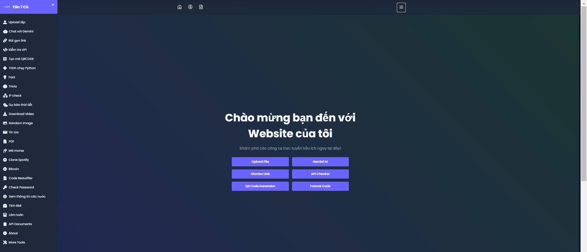

# Tanbaycu - First Web Project 🌐
<p align="center">
  
</p>

---


<p align="center">
  
  
  
</p>

---
- **Project Type**: Multi-tasking Website  
- **Status**: 🟢 Ongoing (Started on: 12/10/2024)  
- **Author**: Me & Flask
- **Support**: `Github` `VSCode` `Github Copilot` `ChatGPT` `Gemini` `Thonny`

--- 
## 🛠️ Tech Stack

- **Frontend**: `HTML`, `CSS (Bootstrap)`, `Tailwind CSS`, `Javascript`
- **Backend**: `Python (Flask)`
- **APIs**: `OpenWeatherMap`, `TinyURL`, `GoFile`, etc.
- **Database**: `Flask-SQLAlchemy`, `Vercel-KV`
- **Hosting**: `Vercel`
---

---
## 📜 Table of Contents
1. [Overview](#tanbaycu---first-web-project-🌐)
2. [Tech Stack](#🛠️-tech-stack)
3. [Features](#🚀-key-features)
4. [Version History](#🛠️-version-details)
5. [Important Notes](#ℹ️-important-notes)
6. [Sample Code](#👨‍💻-sample-code)
7. [Future Plans](#🚧-future-roadmap)
8. [Demo Video](#🎥-demo-video)
9. [Credits](#🙏-credits)

## 🚀 Key Features:

This website project comes with a rich set of features, designed to simplify tasks and enhance user experience. Below are some of the core services provided:

- 📁 **File Upload** 

  Easily upload files to API GoFile and Pixeldrain with a fast and user-friendly interface.

- 🤖 **Chat with Gemini**

  Console-like web interface combined with Gemini chat. - Update 18/10

- 🔗 **Link Shortening**  
  Convert long URLs into short, easy-to-share links using TinyURL and v.gd.

- 🔍 **API Testing**  
  Verify and inspect HTTP requests using the built-in API testing tool.

- 📱 **QR Code Generation**  
  Generate QR codes from text or URLs, perfect for advertising and payments.

- 🐍 **Online Python Execution**  
  Run Python code directly in the browser with some limitations, ideal for quick testing.

- 🤓 **Random Facts**  
  Discover fun and random facts across various topics via JokeAPI and UselessAPI.

- 🌐 **IP Address Lookup**  
  Get detailed information about your IP address, including location and ISP.

- 🌦️ **Weather Forecasting**  
  Get accurate weather information using data from OpenWeatherMap.

- 🎥 **Video Downloading**  
  Download videos from various sources using yt-dlp, helping you save your favorite content.

- 🖼️ **Random Image Display**  
  Explore random images served through our API, offering a refreshing and engaging experience.

- 📰 **Latest News**  
  Stay updated with the latest news through our integrated news API service.

- ➕ **Math Operations with Newton API**  
  Perform complex mathematical operations easily using the Newton API.

Each of these features is designed to enhance productivity and deliver a seamless user experience. The project is continuously being updated, and more functionalities will be added over time.

---

## 🛠️ Version Details

| Feature                      | Type     | Release Date     | Description                                                       |
|------------------------------|----------|-------------------|------------------------------------------------------------------|
| **Gemini Chat**              | New Form | 18/10/2024        | A chat feature currently in beta testing, designed to enhance user interaction on the site. |
| **About**                    | Update   | 19/10/2024        | New version -e.                                                 |
| **PDF Upload**               | New      | 20/10/2024        | Added PDF upload functionality for users.                       |
| **More Tools**           | New      | 20/10/2024        | Added a web page containing various tools for developers.       |


---

## ℹ️ Important Notes

- Để xem các bản cập nhật giao diện mới nhất, vui lòng truy cập [Trang chủ](https://tanbaycu.vercel.app) và **xóa bộ nhớ cache của trình duyệt**. Do ứng dụng sử dụng các route, trình duyệt của bạn có thể tải một phiên bản cũ của trang web từ bộ nhớ cache thay vì phiên bản mới nhất. Việc xóa cache sẽ đảm bảo rằng bạn thấy giao diện và tính năng mới nhất.
- Tất cả các chức năng của trang web đều được hỗ trợ bởi các API để đảm bảo tích hợp và hiệu suất liền mạch.


## 👨‍💻 Sample Code:

Here’s a simple Python print statement demonstrating the spirit of **Tanbaycu**:

```bash
print("Hello World, I Am Tanbaycu")
```

---

Thank you for visiting **my website**. Stay tuned for future updates and new features! 🎉

---

## 🚧 Future Roadmap

- [ ] Add web convert files
- [ ] Add user authentication and profiles
- [ ] Implement additional APIs for stock market data
- [ ] Mobile app integration

## 🎥 Demo Video

Xem video giới thiệu dự án tại [đây](https://player.vimeo.com/video/1021034750?badge=0&autopause=0&player_id=0&app_id=58479).

 


## 🚀 Project Milestones

| Milestone           | Status        | Progress      |
|---------------------|---------------|---------------|
| Add authentication  | 🟡 In progress | [=======     ] 70% |
| API integrations    | 🟢 Done        | [==========] 100% |
| Mobile integration  | 🔴 Not started | [            ] 0% |

---


## 🎉 Live Demo
Check out the live demo of Tanbaycu [here](https://tanbaycu.vercel.app).

Or click the button below to launch it directly:

<p align="center">
  <a href="https://tanbaycu.vercel.app"></a>
</p>

---
## 🌐 For More
- [AI EB2](https://eb2.vercel.app)
- [Dự án B](https://pdf-05.engineer.run) 

---

## 🙏 Credits

- The project is inspired by the [Flask Documentation](https://flask.palletsprojects.com/) and its community.
- UI frameworks used: [Bootstrap](https://getbootstrap.com/) for responsive design and [Tailwind CSS](https://tailwindcss.com/) for utility-first styling.
- Hosting provided by [Vercel](https://vercel.com/).
- API integrations include:
  - [OpenWeatherMap](https://openweathermap.org/api) for weather data.
  - [TinyURL](https://tinyurl.com/) for URL shortening.
  - [GoFile](https://gofile.io/) for file uploads.
  - [JokeAPI](https://v2.jokeapi.dev/) and [UselessAPI](https://uselessapi.com/) for fun facts.
  - [Newton API](https://newton.now.sh/) for complex mathematical operations.
- Special thanks to:
  - [ChatGPT](https://chat.openai.com/) for assistance in project development.
  - [Github Copilot](https://github.com/features/copilot) for coding support.
- Community support from Stack Overflow and Reddit.
- Learning resources from Udemy and Coursera.
- Graphics and icons sourced from [Flaticon](https://www.flaticon.com/) and [Unsplash](https://unsplash.com/).


